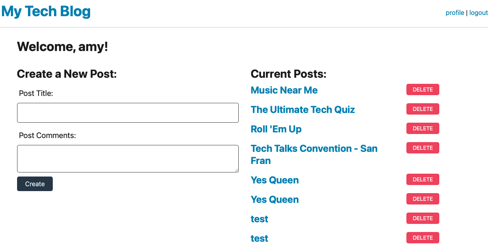

## tech blog
Welcome to my tech blog! A CMS- Style blog that allows you to log in to be able to see and create blog posts. 

### Description
This app was created with full-stack software development strategies. 

### Install
Clone, use node packages, deploy with heroku using jaws.

### Preview 

### Links
* heroku:  https://tech-blog-78130.herokuapp.com/
* login: user@gmail.com / asdf
* repo: https://github.com/AmyWilhoite/tech-blog-78130.git  
* heroku git: https://git.heroku.com/tech-blog-78130.git    

### License
  